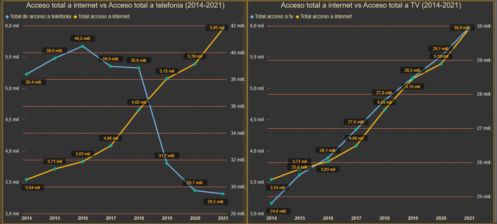

# Analisis de acceso a internet - PI03

Este proyecto consta del analisis de distintas fuentes de datos sobre servicios de telecomunicaciones en argentina. El objetivo es obtener informacion de este sector para una hipotetica empresa que presta estos servicios y nos contrata como analistas.

La principal herramienta para este proyecto fue Power Bi.

Los datasets utilizados se encuentran en los siguientes links:

1. [Acceso a internet por cada 100 hogares](https://datosabiertos.enacom.gob.ar/visualizations/32226/penetracion-de-internet-fijo-accesos-por-cada-100-hogares/)
2. [Acceso a internet por tecnologia y localidad](https://datosabiertos.enacom.gob.ar/dataviews/252830/accesos-a-internet-fijo-por-tecnologia-y-localidad/)
3. [Serie trimestral de acceso a internet por tecnologia](https://datosabiertos.enacom.gob.ar/visualizations/29881/serie-trimestral-de-accesos-a-internet-fijo-por-tecnologia/)
4. [Acceso a TV por provincia](https://datosabiertos.enacom.gob.ar/dataviews/241320/accesos-de-television-por-suscripcion-por-provincia/)
5. [Acceso a telefonia por provincia](https://datosabiertos.enacom.gob.ar/dataviews/241309/accesos-de-telefonia-fija-por-provincia-hogares-comerciales-gobierno-y-otros/)
6. [Poblacion total por partido](https://www.sig.indec.gob.ar/censo2010/?_ga=2.83857361.696039131.1672905576-774713045.1672905576)

---

## Creacion y funcionamiento del dashboard

### **Paso 1**

El primer paso fue crear una nueva columna en los datasets 1, 4 y 5 donde se calcula la variacion porcentual por trimestre. Para este paso se utilizo la libreria pandas, se agrego la nueva columna y se guardaron los datasets modificados en la carpeta "Datasets_modificados". El codigo utilizado esta en el archivo "EDA.ipynb".

Si bien para este paso se podria haber cargado el script de python directamente en Power Bi elegi mantener los datasets modificados en un archivo separado para mantener cierto orden y tener un respaldo de los datos con los que voy a trabajar.

### **Paso 2**

Se cargan los datos en Power Bi y utilizando la herramienta de transformacion de datos se modifican las columnas y filas, por ejemplo el reemplazo de puntos por comas para evitar errores al hacer el cambio de tipo de datos, cambio de tipo de datos a enteros y decimales en las columnas que corresponde y creacion de las relaciones entre las distintas tablas.

Tambien se creo una nueva tabla en donde se combinaron los datasets 1,4 y 5 para poder trabajar con facilidad con los filtros de los datos de acceso a TV, Telefonia e Internet.

Todos estos cambios se pueden ver en orden desde la misma herramienta. Si bien este paso tambien se podria haber realizados con pandas en Power Bi se realizan con mayor facilidad y rapidez.

### **Paso 3**

A partir de este paso empieza la creacion del dashboard. En la pagina 1 utilice un mapa ArcGis al cual le agregue los valores de la columna Provincia de la tabla combinada. Luego agregue un grafico de columnas agrupadas y lineas el cual contiene la variacion trimestral de internet en el eje Y, los valores de la columna Año en el eje X, y la linea esta compuesta con la suma total del acceso a internet.

Al combinar el mapa con este grafico de columnas se puede filtrar haciendo click sobre la provincia a elegir en el mapa y asi obtener informacion detallada de esa provincia. 

Para todas las paginas use un filtro que elimina los datos que correspondan al año 2022 debido a que este año solo contiene informacion de un trimestre y por lo tanto los datos estan incompletos.

### **Paso 4**

Para la pagina 2 agregue nuevos botones para filtrar por provincia y por trimestre y 3 celdas con KPI donde se puede ver la variacion de Internet, TV y Telefonia.

Despues utilice dos graficos de lineas distintos, ambos tienen los valores de trimestre en el eje X. En uno hice una comparacion entre el total del Acceso a telefonia y el total de acceso a internet, y en otro hice una comparacion del total de acceso a TV con el total de acceso a internet.

De esta manera, lo que busque es analizar la relacion entre la variacion de accesos a TV y Telefonia con el acceso a internet y a la vez crear una herramienta que permita realizar este analisis facilmente por provincia y año.

### **Paso 5**

En la pagina 3 agregue una nueva comparacion de la variacion de acceso a TV, Telefonia e Internet, pero esta vez filtrando solo por el año 2021, que es el ultimo año del que se tiene registros completos en los dataset. En el grafico superior de columnas agrupadas tambien filtre las 10 provincias con mayor variacion de acceso a internet, de esta forma se pueden visualizar mejor los datos la vez que se obtiene informacion de las provincias pertinentes al analisis.

En el segundo grafico de columnas agrupadas, se compara la informacion del total de acceso a internet con la poblacion total filtrado por partido. En este caso al elegir una de las provincias del grafico superior automaticamente se obtienen los partidos en este grafico. De esta manera se visualizan mejor los datos la filtrar solo lo mas importante. El calculo se hace dividiendo el total de conexiones a internet sobre la poblacion total del partido. Tambien se agrega una linea en donde se puede ver la poblacion total de cada partido.

Por ultimo agregue botones para filtrar por trimestre, en este caso los trimestres del 2021 y un ultimo grafico de barras agrupadas para comparar la proporcion de conexiones ADSL y de Fibra optica sobre el total de conexiones filtrado por localidad.

# Analisis de los datos

La primera hipotesis que se hizo fue si la disminuicion en servicios de telefonia y television indican un aumento de las conexiones a internet, y si de esta manera estos datos se pueden usar como indicador para verificar si es viable para la empresa expandir sus servicios en las regiones estudiadas.

La primera conclusion a la que se llega es que entre el año 2014 y el año 2021, que son los años estudiados, el acceso a internet tuvo una mayor variacion positiva que el servicio de TV por subscripcion y los servicios de telefonia tuvieron una variacion negativa.

Luego se puede corrobar que efectivamente el numero total de accesos a telefonia fija viene en declive, con una pendiente mas inclinada a partir del 2018, mientras que el total de accesos a internet viene en aumento junto con el total de acceso a Television por subscripcion.

Esto nos permite establecer una regla a seguir y realizar ahora un analisis por provincia, siguiendo la nueva hipotesis de que si en una determinada provincia el total de accesos a TV aumenta y el total de accesos a telefonia disminuye entonces es posible que el acceso a internet aumente en esa provincia.

Suponiendo ahora que se quiere hacer una analisis para una posible inversion en el año 2022, se utiliza el grafico de la pagina 3 en el cual se filtra por las 10 provincias con mayor variacion de acceso a internet en el año 2021 y se compara con la variacion de TV y Telefonia.

Las provincias que parecen mas viables para invertir en internet son la rioja, tierra del fuego, chubut y catamarca, teniendo en cuenta lo aclarado anteriormente.

Ahora se lleva a cabo una analisis en las provincias a eleccion, por ejemplo si hacemos una analisis de chubut:

En el caso de chubut el partido de escalante parece la mejor opcion debido a la baja cantidad de accesos a internet en comparacion con su poblacion. Ademas se puede observar que tiene casi el mismo porcentaje de conexiones a internet que los partidos de rawson y biedma siendo que estos dos partidos tienen casi la mitad de poblacion que Escalante.

Ahora se hace un analisis del partido de escalante, siguiendo una nueva hipotesis basada en este grafico obtenido de la pagina de enacom.

En este grafico se puede obserbar que la disminuicion de ADSL indica un aumento de conexiones de fibra optica, lo cual tiene sentido si se tiene en cuenta que las conexiones por ADSL son una tecnologia anterior a la fibra optica y hoy en dia esta siendo reemplazada por esta.

La nueva hipotesis que se hace es que las localidades donde haya mayor cantidad de conexiones de ADSL que de Fibra optica, son una buena opcion para invertir en conexiones de fibra optica o cablemodem haciendo la suposicion de que en los hogares o empresas de la localidad se van a buscar mejores velocidades que cada vez son mas requeridas y que las conexiones ADSL no pueden proveer.

Siguiendo este analisis sobre el partido de escalante en la provincia de chubut:

En este caso la localidad de comodoro rivadavia parece la mejor opcion debido a la alta proporcion de conexiones ADSL en comparacion con la cantidad de conexiones de fibra optica.

Finalizando el analisis, se puede concluir que la mejor region para expandirse e invertir en conexiones de fibra optica es la region de la patagonia, siendo las provincias de chubut y tierra del fuego las mejores candidatas.

## Conclusion

El proyecto ofrece total libertad para el analisis sobre el campo de las telecomunicaciones, lo cual permite una amplia variedad de metodologias para llevar a cabo. En mi caso decidi crear una herramienta que sea lo mas interactiva posible con los datos dados, y que permita realizar distintos tipos de analisis para el hipotetico caso de que la empresa busque expandir sus servicios de internet, mas especificamente de fibra optica, y este buscando regiones como candidatas.

Con este proyecto puedo concluir que lo principal para un buen analisis es tener buenas fuentes de datos. Las fuentes de datos utilizadas no presentaban muchos errores o datos faltantes, aunque se una empresa real buscara un determinado objetivo seguramente hagan falta muchos mas datos para tener en cuenta todas las variables y llegar a mejores conclusiones.
